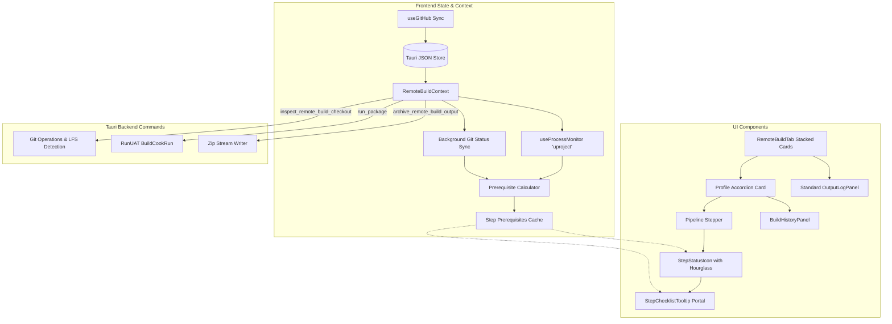

# Requirements

### Overview & Goals
The Automatic Build feature automates repository synchronization, Unreal Engine project packaging (`BuildCookRun`), archive compression, and retention cleanup. This proposal upgrades the feature and resolves identified UX edge cases:
1. **Dynamic Step Prerequisite Evaluation**: Continuous real-time validation of pre-flight requirements across all pipeline steps (Clone, Repo Sync, Packaging, Archiving, Cleanup).
2. **Interactive Status Icons & Hover Checklists**: High-density visual indicators for each step that reveal an unclipped, auto-positioned diagnostic checklist on hover.
3. **Pipeline Sequencing & Status States**: Future stages display an hourglass icon whenever a preceding stage is actively running.
4. **Immediate GitHub Repository Sync**: Immediate repository loading upon GitHub authentication without requiring launcher restarts, plus auto-reloading inside the profile creation modal.
5. **Preserved Output Log Layout**: Reversion of the output log panel back to the standard launcher layout and behavior.
6. **Clock Icon (`<TbClockPlay />`) & Schedule Toggle Switch**:
   - Display the dedicated clock-play icon (`TbClockPlay`) in the general launcher navigation tab bar for "Automatic build".
   - Display the `TbClockPlay` icon in the Automatic Build header before the main title.
   - Replace the generic text "Active" button on profile cards with a sleek, interactive schedule toggle switch incorporating the clock icon.
7. **Run History & Diagnostics Inspector**: Comprehensive execution history per build profile stored in application state.
8. **Game-Dev UI Overhaul & Hardening**: A modern stacked accordion card interface with robust edge-case protections (active Unreal processes, dirty worktrees, conditional Git LFS).

---

### Scope
#### In Scope
- **Dynamic Prerequisite Engine**:
  - Pre-flight checking for Clone, Repo sync, Unreal Engine Packaging, Zip compression, and Artifact Cleanup.
  - Process detection for active `UnrealEditor.exe` / `UE4Editor.exe` instances blocking packaging, reusing the existing `useProcessMonitor('uproject')` background polling checks.
  - Git status checks (branch match, dirty worktree, staged index, conditional Git LFS check only for repos requiring LFS, remote reachability).
  - Engine and `.uproject` validity checks (matching installed engine version / custom GUID, valid uproject JSON).
- **Hoverable Step Checklist UI & Viewport Positioning**:
  - Compact step status badges (Success, Running, Checking, Waiting/Hourglass, Blocked/Warning, Failed, Disabled).
  - Unclipped floating checklist popovers rendered via React Portal / fixed positioning with viewport collision detection and boundary clamping.
- **Pipeline Stepper Sequencing**:
  - While a preceding step is running, subsequent stages show an animated or distinct hourglass waiting icon.
- **Clock Icon (`<TbClockPlay />`) & Schedule Switch UI**:
  - Main tab navigation icon in `App.tsx` updated to `TbClockPlay`.
  - Automatic build header in `RemoteBuildTab.tsx` adorned with `TbClockPlay` icon preceding the title.
  - Profile card active status button in `ProfileCard.tsx` replaced with a modern toggle switch featuring the clock icon and smooth transition states.
- **GitHub Auth & Repository Loading**:
  - Immediate auto-fetching and refreshing of GitHub repositories upon account connection without requiring application restart.
  - Explicit refresh action and auto-fetch triggers in the profile creation modal.
- **Standard Output Log Integration**:
  - Preserve the original launcher output log view format without intrusive custom card wrappers.
- **Build History & Diagnostics**:
  - Stored run history per profile in Tauri JSON store.
  - Run timeline with duration, commit hash, commit message, author, completion status, and error triage.
  - Error diagnostic viewer modal for failed builds.
- **Modernized Interface**:
  - Stacked collapsible accordion cards for build profiles.
  - Visual horizontal pipeline stepper with progress tracking.
  - Polished settings modal and streamlined profile creation workflow.

#### Out of Scope
- Remote SSH agent build nodes (builds remain local machine automation).
- Cloud storage uploads (S3/GCS) — archiving remains local disk folder management.
- Multi-target concurrent packaging for the same project.

---

### User Stories
- **As a Game Developer**, I want to see at a glance whether my project is ready to package so I don't trigger builds that fail halfway through due to open editor instances or uncommitted files.
- **As a Game Developer**, I want to toggle automatic scheduled builds on and off using an intuitive switch with a clear clock indicator instead of a plain text button.
- **As a Game Developer**, I want the Automatic Build tab and header to feature a recognizable clock-play (`TbClockPlay`) icon consistent across the entire launcher navigation.
- **As a Game Developer**, I want to hover over any build step to see a dynamic checklist of its prerequisites that renders smoothly outside container borders and stays within my screen.
- **As a Game Developer**, I want upcoming pipeline steps to show an hourglass icon while a previous step is running so I know they are queued.
- **As a Game Developer**, I want to connect my GitHub account and immediately pick my repository in the profile modal without needing to restart the application.
- **As a Game Developer**, I want the standard launcher output log window to remain consistent with other tabs.
- **As a Technical Director / Lead**, I want to review recent build history for each profile to quickly see why a scheduled build failed overnight and inspect the error summary.

---

### Functional Requirements
#### 1. Dynamic Prerequisite Evaluation System
- **Clone Step Prerequisites**:
  - GitHub account connected with active access token.
  - Valid target folder path; parent exists; destination empty or non-conflicting.
  - Selected repository and branch exist on remote.
- **Repo Sync Step Prerequisites**:
  - Destination exists and is a valid Git repository.
  - Checked out to configured build branch.
  - Clean working directory (no untracked conflicts or uncommitted modifications).
  - Clean index (no uncommitted staged changes).
  - Remote repository reachable over network.
  - Git LFS check (conditional: only required if the repository contains `.gitattributes` with LFS filters or tracks LFS objects; non-LFS repositories are never blocked).
- **Packaging Step Prerequisites**:
  - No active Unreal Engine processes (`UnrealEditor.exe`, `UE4Editor.exe`), evaluated using the existing `useProcessMonitor('uproject')` background polling state.
  - Valid `.uproject` file found and configured.
  - Engine Association resolved to a valid installed Unreal Engine path.
  - Target platform toolchain available.
  - Destination drive has sufficient free disk space.
- **Zip Archive Step Prerequisites**:
  - Packaging stage succeeded with output directory present.
  - Output files accessible and not locked by external processes.
- **Cleanup Step Prerequisites**:
  - Output directory accessible for pruning old build folders.

#### 2. Interactive Status Badges, Hover Checklist Popovers & Pipeline States
- Each stage displays a distinctive icon indicating its state:
  - `Ready / Passed` (Emerald checkmark)
  - `Running` (Pulsing sky blue spinner)
  - `Waiting / Queued` (Hourglass icon for future stages when an earlier stage is currently running)
  - `Checking` (Subtle pulsing sky radar)
  - `Blocked / Warning` (Amber exclamation indicator)
  - `Failed` (Rose red cross indicator)
  - `Disabled / Skipped` (Muted slate dot)
- Hovering or focusing a step badge opens a popover that:
  - Renders outside the accordion container's `overflow: hidden` bounding box via a React Portal or fixed positioning.
  - Automatically positions itself above or below the target and clamps horizontal offset so it is never clipped by window edges.
  - Displays step title, status badge, checklist items (`Passed`, `Blocking`, `Warning`), and actionable remediation guidance.

#### 3. Clock-Play Icon (`<TbClockPlay />`) & Schedule Toggle Switch
- **Navigation Tab Bar**: Replace the generic server/box icon in `App.tsx` (`TAB_ICONS.remoteBuild`) with the `<TbClockPlay />` clock-play icon.
- **Header Title**: In `RemoteBuildTab.tsx`, render the `<TbClockPlay />` icon with an attractive themed badge container immediately preceding the "Automatic Build" heading.
- **Profile Card Schedule Switch**:
  - In `ProfileCard.tsx`, replace the static "Active" / "Paused" text button with an accessible, animated toggle switch.
  - The switch incorporates a small clock icon alongside or inside the thumb/track, illuminating in emerald when active/enabled and muted slate when paused.
  - Accessible via keyboard focus (`Space` / `Enter`) with proper `role="switch"` and `aria-checked` attributes.

#### 4. GitHub Account Connection & Repository Loading
- When a user connects GitHub in the launcher, `useGitHub` and `ProfileEditorModal` immediately load and cache the repository list without requiring an application restart.
- If the repository list is empty when opening the create profile modal with a connected account, the modal automatically queries GitHub and provides an inline reload button.

#### 5. Preserved Standard Output Log Window
- The output log panel in `RemoteBuildTab.tsx` adheres to the launcher standard:
  `<div className="flex min-h-0 flex-1 flex-col overflow-hidden border-t border-slate-600/60 p-4"><OutputLogPanel /></div>`
- Retains existing search filtering, level toggles, autoscroll behavior, and stop actions.

#### 6. Build History & Run Diagnostics
- Each profile maintains a history of up to 50 runs stored in application state.
- History record fields:
  - `id`, `startedAt`, `completedAt`, `durationSeconds`
  - `commitHash`, `commitSubject`, `author`
  - `trigger`: `'scheduled'` | `'manual'`
  - `status`: `'success'` | `'failed'` | `'blocked'` | `'cancelled'`
  - `failedStage`: `'repo'` | `'package'` | `'zip'` | `'cleanup'`
  - `errorSummary`: brief human-readable error description
  - `logExcerpt`: last 25 lines of output log for instant triage
- Expandable "Build History" section in each profile card displaying run rows, status badges, timestamps, and an "Inspect Error" modal.

#### 7. Stacked Accordion UI & Game-Dev Design
- Full-width stacked accordion cards for build profiles with quick toggles (Schedule Switch, Pull Now, Edit, History).
- Collapsible card body with Pipeline Stepper, configuration summaries, and Embedded Run History.
- Schedule Countdown indicator and global schedule settings modal.

---

### Non-Functional Requirements
- **Performance**: Prerequisite evaluation must be non-blocking and debounced to prevent CPU spikes.
- **Reliability**: Scheduler ticks must never stall if an individual profile or command encounters an error.
- **Accessibility**: Full keyboard navigation support (`Tab`, `Enter`, `Escape`) for popovers and accordion toggles with ARIA attributes.
- **Visual Polish**: High-contrast dark theme adhering to industrial game-engine design conventions.

# Technical Design

### Current Implementation Analysis
- **Execution Flow**: `RemoteBuildContext.tsx` runs `checkProfile` which executes sequential Tauri commands (`inspect_remote_build_checkout`, `fetch_remote_build_branch`, `update_remote_build_checkout`, `run_package`, `archive_remote_build_output`, `prepare_remote_build_output`).
- **Process Monitoring**: `src-tauri/src/commands/monitor.rs` and `useProcessMonitor('uproject')` already poll active Unreal Engine process states (`UnrealEditor.exe`, `UE4Editor.exe`, etc.) in the background.
- **Identified Refinements**:
  - `useGitHub.ts`: `repositories` state is local to each hook invocation; after OAuth completion, repositories must be refreshed and cached to store so new profile modals can load them immediately.
  - `StepChecklistTooltip.tsx`: Needs portal rendering (`createPortal`) and screen-boundary clamping to avoid being clipped by `ProfileCard`'s `overflow: hidden` and window edges.
  - `PipelineStepper.tsx` & `StepStatusIcon.tsx`: Support `waiting` state with an hourglass icon for upcoming stages when an earlier stage is active.
  - `RemoteBuildTab.tsx`: Restore the original launcher output log panel docking layout.

---

### Key Decisions
1. **Portal-Based Tooltips with Viewport Clamping**:
   - *Decision*: Render the hover checklist popover via React Portal (`document.body`) with calculated fixed positioning and bounding-rect boundary clamping.
   - *Rationale*: Guarantees the popover is never clipped by parent container overflow or screen borders.
2. **Sequential Step State Pipeline with Hourglass Waiting Icon**:
   - *Decision*: In `PipelineStepper.tsx`, if an earlier step in sequence (`clone` -> `repo` -> `package` -> `zip` -> `cleanup`) is currently `running`, mark subsequent unstarted steps as `waiting` (rendering an hourglass icon).
   - *Rationale*: Clearly communicates pipeline progression to game developers.
3. **Clock-Play Icon (`TbClockPlay`) & Switch UX Pattern**:
   - *Decision*: Utilize the `<TbClockPlay />` icon (clock with play indicator) for the `remoteBuild` tab navigation in `App.tsx` and in the `RemoteBuildTab.tsx` header. Replace the profile "Active" text button with a toggle switch component embedded with a clock icon.
   - *Rationale*: Unifies visual branding around automated scheduled execution and provides a tactile, standard switch UX for toggling schedules.
4. **Synchronized GitHub Repository Cache**:
   - *Decision*: Update `useGitHub` to auto-fetch repositories on successful auth and sync cached repos from the Tauri store on hook mount; add an auto-retry / reload trigger in `ProfileEditorModal`.
   - *Rationale*: Eliminates the need to restart the application after authenticating GitHub.
5. **Standard Output Log Integration**:
   - *Decision*: Revert `RemoteBuildTab.tsx` output log section back to the standard launcher flex layout `<OutputLogPanel />`.
   - *Rationale*: Keeps consistency across Launcher tabs (ToolBox, Scheduler, Package).
6. **Reactive Background Prerequisite Evaluation with Existing Monitors**:
   - *Decision*: Combine existing `useProcessMonitor('uproject')` background polling with Git status cache to compute structured `StepPrerequisites` per profile. Git LFS is evaluated conditionally based on repository `.gitattributes` presence.
   - *Rationale*: Eliminates redundant background process polling loops and ensures non-LFS game repositories can be built without requiring Git LFS installation.

---

### Architecture Diagram



---

### Data Models & Contracts

```typescript
export type StepId = 'clone' | 'repo' | 'package' | 'zip' | 'cleanup';

export type ChecklistItemState = 'passed' | 'blocking' | 'warning' | 'info';

export type StepPrerequisiteStatus = 'ready' | 'blocked' | 'warning' | 'running' | 'waiting' | 'disabled' | 'checking';

export interface ChecklistItem {
  id: string;
  label: string;
  state: ChecklistItemState;
  message: string;
  detail?: string;
  remediation?: string;
}

export interface StepPrerequisiteReport {
  stepId: StepId;
  label: string;
  status: StepPrerequisiteStatus;
  items: ChecklistItem[];
  blockingReason?: string;
}

export interface ProfilePrerequisites {
  profileId: string;
  evaluatedAt: string;
  steps: Record<StepId, StepPrerequisiteReport>;
}

export interface RemoteBuildRunSummary {
  id: string;
  commitHash: string;
  commitSubject?: string;
  author?: string;
  trigger: 'scheduled' | 'manual';
  startedAt: string;
  completedAt: string;
  durationSeconds: number;
  status: 'success' | 'failed' | 'blocked' | 'cancelled';
  failedStage?: StepId;
  errorSummary?: string;
  logExcerpt?: string;
}
```

---

### Prerequisite Rule Matrix

| Stage | Checklist Item | Evaluation Rule | Block State |
|---|---|---|---|
| **Clone** | GitHub Auth | Token present in secure store | `blocking` if disconnected |
| | Target Folder | Directory path valid & parent exists | `blocking` if missing parent |
| | Destination Free | Directory is empty or has no conflicting checkout | `blocking` if non-empty / invalid |
| **Repo** | Git Checkout | `.git` folder exists & valid repo | `blocking` if not cloned |
| | Branch Match | HEAD branch equals `profile.buildBranch` | `blocking` if mismatched |
| | Clean Worktree | `git status --porcelain` is clean | `blocking` if dirty files exist |
| | Clean Index | Staged index has no uncommitted changes | `blocking` if uncommitted index |
| | Git LFS | Operational if repository has `.gitattributes` LFS filters | `blocking` only if repo uses LFS & missing |
| | Remote Sync | Git fetch succeeds & remote commit reachable | `warning` if unreachable |
| **Package** | Editor Process | `UnrealEditor.exe` NOT running (via `useProcessMonitor`) | `blocking` if UE running (PID listed) |
| | Project File | `.uproject` exists and is valid JSON | `blocking` if missing / invalid |
| | Engine Install | `EngineAssociation` matches installed engine | `blocking` if engine not found |
| | Disk Space | Target drive has > 10GB free space | `warning` if < 10GB, `blocking` if < 2GB |
| **Zip** | Build Output | Packaged directory exists and contains files | `blocking` if package absent |
| **Cleanup** | Output Root | Output root path valid and writable | `warning` if folder locked |

---

### Component Breakdown & File Structure

```
src/
├── components/
│   ├── RemoteBuildTab.tsx                # Main view with stacked accordion cards & standard OutputLogPanel
│   ├── OutputLogPanel.tsx               # Standard launcher output log panel
│   ├── remoteBuild/
│   │   ├── ProfileCard.tsx              # Collapsible profile card with status bar
│   │   ├── PipelineStepper.tsx          # Stepper with live hourglass indicators for upcoming steps
│   │   ├── StepStatusIcon.tsx           # Multi-state icon (supports waiting/hourglass, running, etc.)
│   │   ├── StepChecklistTooltip.tsx     # Portal-rendered popover with viewport clamping
│   │   ├── BuildHistoryPanel.tsx        # Expandable history timeline & run cards
│   │   ├── RunDiagnosticModal.tsx       # Error inspection & log excerpt modal
│   │   └── ProfileEditorModal.tsx       # Create/Edit profile configuration with auto-reloading repo picker
├── contexts/
│   ├── RemoteBuildContext.tsx           # Scheduler, execution pipeline & prereq cache
│   └── RemoteBuildContextState.ts      # Context interfaces and state types
├── hooks/
│   └── useGitHub.ts                     # GitHub auth & synchronized repository cache
├── utils/
│   ├── remoteBuildPrerequisites.ts      # Pure rule engine for step checklist calculation
│   └── formatDuration.ts                # Time formatting helpers
└── types.ts                             # Core type definitions
```

---

### Edge Cases & Mitigations
1. **GitHub Connected Mid-Session**:
   - *Mitigation*: Automatically fetch repository cache when authentication completes and reload on opening the profile modal.
2. **Tooltip Rendered Near Window Edge or Inside Nested Accordion**:
   - *Mitigation*: Use React Portal and dynamic viewport bounding rect calculation to position and flip tooltips cleanly without clipping.
3. **Pipeline Stages in Progress**:
   - *Mitigation*: When a stage is running, subsequent stages render an hourglass icon indicating they are queued.
4. **Unreal Editor Launched Mid-Schedule**:
   - *Mitigation*: Process check is evaluated immediately before `run_package` invocation. If detected, the job is paused or marked `blocked` with clear notification.
5. **Dirty Worktree with Local Modifications**:
   - *Mitigation*: Repo step detects uncommitted changes and prevents automated checkout update.

# Testing

### Validation Approach
Verification of dynamic prerequisite evaluation, checklist popovers, GitHub repository loading, pipeline sequencing, output log layout, and run history tracking.

---

### Key Scenarios

1. **Clock-Play Icon & Header Presentation**:
   - *Action*: Inspect the launcher main navigation bar and Automatic Build tab header.
   - *Expected*: The "Automatic build" tab icon displays the `<TbClockPlay />` clock-play icon. The Automatic Build header displays the matching `<TbClockPlay />` icon in a stylish accent container preceding the title.

2. **Schedule Toggle Switch Interaction**:
   - *Action*: Click or use keyboard space/enter on the schedule switch in a profile card.
   - *Expected*: The switch transitions smoothly between active (emerald background, active clock indicator) and paused (slate background, muted clock indicator) without misaligning the card header.

3. **GitHub Auth & Dynamic Repository Loading**:
   - *Action*: Start launcher disconnected, connect GitHub, then open Create Profile modal.
   - *Expected*: Repository list loads immediately without requiring an application restart.

4. **Unclipped Checklist Tooltip & Viewport Clamping**:
   - *Action*: Hover over any step icon in an expanded or collapsed profile card near screen edges.
   - *Expected*: Tooltip renders cleanly above or below without being clipped by the accordion card border or overflowing offscreen.

5. **Pipeline Stage Sequencing & Hourglass Icon**:
   - *Action*: Trigger a build run. While `Repo Sync` or `Package` is running, observe the subsequent stages (`Zip`, `Cleanup`).
   - *Expected*: Preceding running step shows spinner; subsequent unstarted stages display an hourglass waiting icon.

6. **Preserved Output Log Panel**:
   - *Action*: Toggle the output log in Automatic Build tab.
   - *Expected*: Renders in the standard launcher docked flex panel matching other launcher tabs.

7. **Unreal Engine Process Blocking Detection**:
   - *Action*: Launch Unreal Editor with the project open, then inspect the Package step icon.
   - *Expected*: Package step displays an amber blocked icon. Hovering shows *"Unreal Engine is running"* with the detected process PID and clear instructions to close the editor.

8. **Build History Recording & Failure Triage**:
   - *Action*: Trigger build run and verify run summary is recorded in history. Check diagnostic modal on failure.

---

### Edge Cases to Validate
- Network failure during GitHub branch polling (displays warning in Repo checklist without crashing scheduler).
- Multiple `.uproject` files in repository root (checklist prompts user to select a specific `.uproject`).
- Archive only mode enabled with keep-builds count (verifies zip file creation and removal of unpacked directories).

### ✓ Step 1: Pause global scheduling during manual builds
- Stop the global scheduling clock when “Build Now” starts.
- Prevent scheduled profiles from starting while the manual build is active.
- Restore the scheduling clock after the manual build finishes.

### ✓ Step 2: Verify manual scheduling safety
- Run the relevant frontend validation and confirm the scheduler behavior.

### ✓ Step 3: Fix packaging blocked status during active packaging and conditionally render zip stage
- Prevent the package step prerequisite from evaluating as blocked when a package build is actively running (or another profile is packaging).
- Only display the Zip pipeline stage when zip archiving is enabled in schedule settings.
- Verify through type checking and frontend builds.

### ✓ Step 4: Fix deleted clone directory detection and restore clone button
- Dynamically detect missing or deleted local checkout directories on disk and reflect that in the prerequisite engine.
- Display the "Clone Repo" button on profile cards when the local checkout is missing, preventing repository sync error cascades.
- Synchronize profile clone status and pause scheduled runs when a checkout folder is deleted.
- Verify through type checking and frontend build validation.

### ✓ Step 5: Trigger build for up-to-date commit without existing packaged build
- Detect when a repository branch is up-to-date with remote HEAD but lacks a successfully generated build on disk for that commit.
- Trigger the build packaging pipeline on manual builds, post-clone initial runs, or scheduled checks when no output exists for the commit.
- Verify through type checking and frontend production build.

### ✓ Step 6: Preserve schedule active state when cloning repository
- Remove the unintended `enabled: false` reset during clone operations in `RemoteBuildTab.tsx`.
- Ensure profiles retain their active scheduling configuration throughout the clone process and upon clone completion.
- Verify through type checking and frontend production build.

### ✓ Step 7: Replace output log button with GitHub status and show GitHub auth conditionally
- Remove the "Output Log" button from the Automatic Build page header.
- Display GitHub authentication status in the header with a pulsing green/red indicator dot.
- Conditionally render the existing GitHub auth card in place of the build profiles section when disconnected, and display the build profiles section when connected.
- Verify through type checking and frontend production build.

### ✓ Step 8: Validate Unreal Engine .gitignore entries in repo sync prerequisite check
- Implement .gitignore inspection in Rust (`validate_unreal_gitignore`) checking for required Unreal Engine generated folders (`Binaries`, `DerivedDataCache`, `Intermediate`).
- Expose `gitignoreValid` and `gitignoreMissingEntries` in `CheckoutStatus` interface.
- Add `.gitignore` validation checklist item and remediation instructions to the Repo Sync stage prerequisite evaluation in `remoteBuildPrerequisites.ts`.
- Block repo sync execution in `RemoteBuildContext.tsx` if `.gitignore` is missing required entries.
- Verify through Rust backend unit tests, TypeScript compilation, and frontend production build.

### ✓ Step 9: Display download progress percentage when cloning repository
- Added `--progress` flag to git clone arguments in Rust backend.
- Implemented streaming stderr/stdout reader in `clone_github_repository` that splits on `\r` and `\n` to parse Git progress percentages (`Receiving objects`, `Resolving deltas`, `Updating files`) and emits `progress-update` and `log-output` events.
- Added `cloneProgress?: number;` to `RemoteBuildProfile` type.
- Updated `RemoteBuildContext` to listen for progress updates when a profile is cloning and track `cloneProgress`.
- Updated `PipelineStepper` to display `{Math.round(progress)}%` beside the Clone stage when active.
- Reset `cloneProgress` in `handleCloneNow` on start, success, and failure.
- Verified with Rust unit tests (`cargo test`) and production frontend build (`npm run build`).

### ✓ Step 10: Stop global scheduler clock when GitHub is disconnected
- Clear and persist `scheduleNextAt` as undefined in `RemoteBuildContext.tsx` whenever GitHub is disconnected or no active account is present.
- Prevent timer tick and profile effect from initializing countdown schedules when disconnected.
- Update `RemoteBuildTab.tsx` schedule status bar to show "Schedule paused: GitHub disconnected" with a rose indicator.
- Verify through type checking and frontend production build.