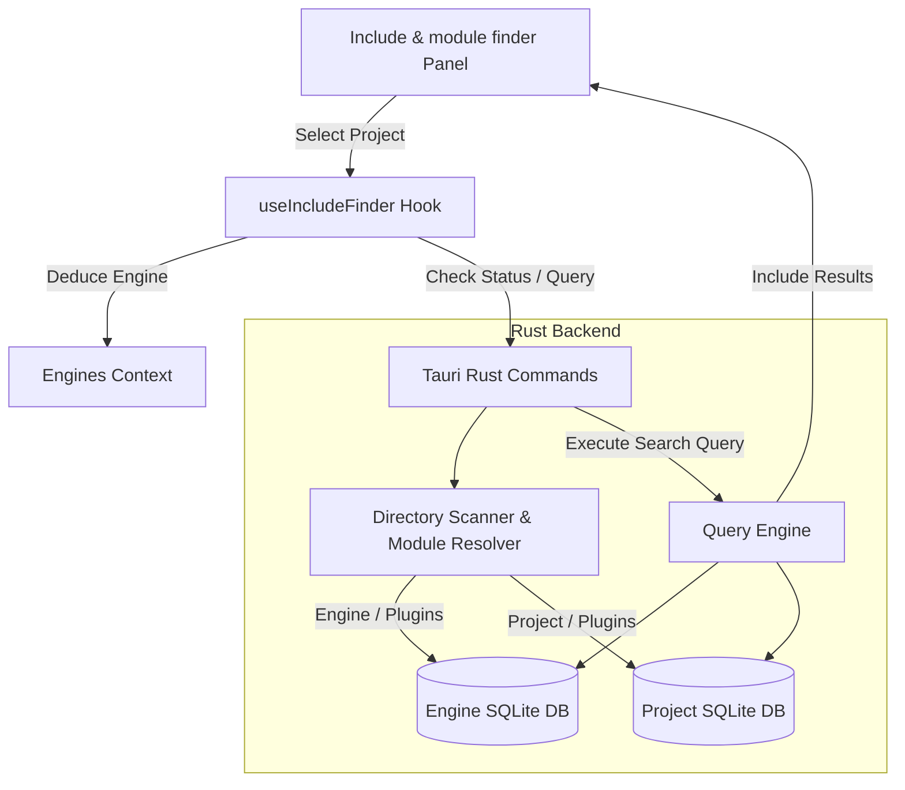

# Requirements

### Overview & Goals
The **Include & module finder** is a standalone developer productivity tool integrated into the UE Launcher ToolBox. In Unreal Engine C++ development, finding the exact `#include` path and the corresponding `.Build.cs` module name (e.g., `PublicDependencyModuleNames.AddRange(...)`) for engine classes, plugins, and project source files is a constant source of friction.

This tool implements **The Hybrid Model**:
- **No shipped static pre-indexed database**: Keeps app bundle lightweight and avoids stale data across disparate UE versions.
- **Engine-level Persistent Local Index**: Scans an installed engine version once (including its core modules and engine plugins) and caches the index locally in SQLite. The index is reused across all projects running that engine version.
- **Project-level Fast Index**: Scans the active project's `Source/` and `Plugins/` directories, keeping project-specific modules up to date.
- **Auto-deduced Engine Association**: Selecting a project automatically resolves its attached engine version and verifies if the engine index is ready or requires an initial scan.

### Scope
#### In Scope
- Indexing Unreal Engine core source (`Engine/Source/Runtime`, `Engine/Source/Developer`, `Engine/Source/Editor`, etc.).
- Indexing Unreal Engine plugins (`Engine/Plugins/**/Source/**`).
- Indexing Project source files (`<ProjectDir>/Source/**`).
- Indexing Project plugins (`<ProjectDir>/Plugins/**/Source/**`).
- Associating header files (`.h`, `.hpp`, `.inl`, `.inc`) with their parent `.Build.cs` module name and calculating standard include paths (relative to `Public/`, `Classes/`, or module root).
- Local SQLite caching stored in app data per engine version and per project.
- Real-time instant search with scope filtering (All, Engine Core, Engine Plugins, Project Source, Project Plugins).
- One-click copy buttons for `#include "..."` and `.Build.cs` module dependency.
- Integration into the `ToolBox` tab with project selector and engine scan status indicators.

#### Out of Scope
- Full C++ AST code completion or semantic type inspection (headers and modules mapping only).
- Automatic editing/injection of `#include` lines into user source files.

### User Stories
- **As an Unreal Engine C++ developer**, I want to search for a header or class name and immediately get the `#include` directive and `.Build.cs` module name so that I can resolve compilation errors without manually browsing engine source.
- **As a developer working across multiple engine versions**, I want each engine version to be indexed once and cached locally so that subsequent searches are instantaneous.
- **As a developer with custom plugins in my project**, I want the tool to include my project's plugins and source modules alongside the engine headers.

### Functional Requirements
- **Project Selection & Engine Deduction**:
  - The tool provides a project selector dropdown (using existing projects or browsing for `.uproject`).
  - When a project is selected, the tool deduces the associated engine version and installation path using `analyse_uproject` and registry/settings engine data.
- **Scan & Index Status**:
  - Displays the engine scan status (e.g., `Engine 5.4.4: 18,420 headers indexed (412 modules)` or `Engine 5.4.4: Not indexed yet`).
  - If the engine is not indexed, prominently prompts the user to scan with a single click.
  - Provides a progress bar and file counter during active indexing.
  - Displays project index status with a quick refresh button.
- **Search & Filtering**:
  - Fast search input with instant debounced filtering.
  - Matches header file names, include paths, and module names.
  - Scope filter chips/checkboxes: All, Engine Core, Engine Plugins, Project Source, Project Plugins.
- **Results & Actions**:
  - Table showing Header File, Suggested `#include`, Module Name, Scope/Plugin, and File Path.
  - "Copy Include" button: copies `#include "<IncludePath>"` to clipboard.
  - "Copy Module" button: copies `<ModuleName>` to clipboard.
  - "Copy Both" action.
  - "Open in IDE" / "Show in Explorer" buttons.

### Non-Functional Requirements
- **Performance**: High-speed multi-threaded scanning in Rust capable of indexing standard UE5 source (20,000+ files) in under 3-5 seconds.
- **Memory Efficiency**: Search queries execute directly against SQLite without loading entire databases into application memory.
- **Offline / Standalone**: Operates 100% locally on the user's workstation without network dependencies.

# Technical Design

### Current Implementation
- The application is built with **Tauri 2 (Rust backend)** and **React 18 + Vite + Tailwind CSS (frontend)**.
- Existing tools in `src/components/ToolBoxTab.tsx` use independent panel components (`RegenerateProjectPanel`, `PluginHelperPanel`, `UELogAnalyzerPanel`, etc.).
- Project metadata and engine associations are managed via `useProjects`, `analyse_uproject`, and `useEngines`.
- Tauri commands in `src-tauri/src/commands/` handle file system traversal (`walkdir`), process execution, and system registry queries.

### Key Decisions
- **Persistent SQLite Database per Engine**: Use `rusqlite` (bundled) with on-disk database files in the app data directory (`{app_data_dir}/include_indices/engine_{version}.db`). SQLite provides high-speed indexed search, persistent caching, and minimal memory usage when idle.
- **Header & Module Path Mapping**: Rather than heavy C++ AST parsing, map all header files (`.h`, `.hpp`, `.inl`, `.inc`) to their nearest parent `.Build.cs` module. Calculate include paths relative to `Public/`, `Classes/`, or module source roots. This enables blazing-fast multi-threaded indexing and exact header/module resolution.
- **Two-Tier Index Architecture**: Separate Engine Index (persisted per engine version across projects) and Project Index (persisted per project path). When searching, results are queried and merged seamlessly.

### Architecture Diagram


### Proposed Changes

#### 1. Backend (`src-tauri`)
- Add `rusqlite = { version = "0.32", features = ["bundled"] }` to `src-tauri/Cargo.toml`.
- Create `src-tauri/src/commands/include_finder.rs`:
  - `scan_engine_includes(engine_root: String, engine_version: String, app_handle: AppHandle)`: multi-threaded file walker scanning `Engine/Source` and `Engine/Plugins`, mapping headers to `.Build.cs` modules and storing them in SQLite. Emits progress events `include-finder:progress`.
  - `scan_project_includes(project_path: String, app_handle: AppHandle)`: scans project `Source/` and `Plugins/`, storing in project SQLite cache.
  - `get_include_index_status(engine_version: String, project_path: Option<String>)`: returns header/module counts and last indexed timestamps.
  - `search_includes(query: String, engine_version: Option<String>, project_path: Option<String>, scopes: Vec<String>, limit: usize)`: performs fast parameterized SQL search with ordering by relevance.
  - `clear_engine_include_index(engine_version: String)`: removes the SQLite database for a specific engine version.
- Register new commands in `src-tauri/src/commands/mod.rs` and `src-tauri/src/lib.rs`.

#### 2. Frontend (`src`)
- Create `src/types/includeFinder.ts`: TypeScript definitions for `IncludeEntry`, `IndexStatus`, `SearchScope`, and `ScanProgress`.
- Create `src/hooks/useIncludeFinder.ts`: custom hook encapsulating engine version deduction, index status queries, scan triggering, progress tracking, and debounced search.
- Create `src/components/IncludeModuleFinderPanel.tsx`:
  - Project selector with automatic engine version resolution.
  - Engine scan status card with "Scan Engine" action and progress bar.
  - Search input with clear button, match counter, and scope filter toggles (`All`, `Engine Core`, `Engine Plugins`, `Project`, `Project Plugins`).
  - Interactive results table with quick-copy actions (`#include`, Module Name, or Both) and "Open in IDE" / "Show in Explorer".
- Update `src/components/ToolBoxTab.tsx` to add `include-finder` to the `TOOLS` list with an icon.

### Data Models / Contracts

#### SQLite Database Schema (`include_indices/*.db`)
```sql
CREATE TABLE IF NOT EXISTS headers (
    id INTEGER PRIMARY KEY AUTOINCREMENT,
    header_name TEXT NOT NULL,       -- e.g. "GameplayStatics.h"
    include_path TEXT NOT NULL,      -- e.g. "Kismet/GameplayStatics.h"
    module_name TEXT NOT NULL,       -- e.g. "Engine"
    scope TEXT NOT NULL,             -- "engine", "engine_plugin", "project", "project_plugin"
    plugin_name TEXT,                -- e.g. "Niagara" (NULL for core engine / project)
    file_path TEXT NOT NULL,         -- Absolute file path on disk
    relative_path TEXT NOT NULL      -- Relative path from root
);

CREATE INDEX IF NOT EXISTS idx_header_name ON headers(header_name);
CREATE INDEX IF NOT EXISTS idx_module_name ON headers(module_name);
CREATE INDEX IF NOT EXISTS idx_include_path ON headers(include_path);
CREATE INDEX IF NOT EXISTS idx_scope ON headers(scope);
```

#### TypeScript Types (`src/types/includeFinder.ts`)
```typescript
export type IncludeScope = 'engine' | 'engine_plugin' | 'project' | 'project_plugin';

export interface IncludeEntry {
  id: number;
  headerName: string;
  includePath: string;
  moduleName: string;
  scope: IncludeScope;
  pluginName?: string | null;
  filePath: string;
  relativePath: string;
}

export interface IndexStatus {
  engineVersion: string;
  engineIndexed: boolean;
  engineHeaderCount: number;
  engineModuleCount: number;
  engineLastScanned?: string | null;
  projectIndexed: boolean;
  projectHeaderCount: number;
  projectModuleCount: number;
  projectLastScanned?: string | null;
}

export interface ScanProgressPayload {
  stage: 'discovering_modules' | 'indexing_headers' | 'finalizing';
  currentCount: number;
  totalEstimated?: number;
  currentFile?: string;
}
```

### File Structure
- Added:
  - `src-tauri/src/commands/include_finder.rs`
  - `src/types/includeFinder.ts`
  - `src/hooks/useIncludeFinder.ts`
  - `src/components/IncludeModuleFinderPanel.tsx`
- Modified:
  - `src-tauri/Cargo.toml`
  - `src-tauri/src/commands/mod.rs`
  - `src-tauri/src/lib.rs`
  - `src/components/ToolBoxTab.tsx`
  - `docs/TOOLBOX.md`

### Risks & Mitigations
- **Large Engine Source Trees**: UE source can contain 30,000+ files. *Mitigation*: Multi-threaded directory traversal using `walkdir` + batch SQL inserts within a single SQLite transaction, completing indexing in 2-4 seconds.
- **Unconventional Header Layouts**: Some third-party headers lack standard `Public/` folders. *Mitigation*: Fallback to module-relative paths if neither `Public` nor `Classes` subdirectories are found.
- **Concurrent Searches during Scan**: *Mitigation*: Perform scan into a temporary/isolated SQLite transaction and atomic swap, keeping search responsive.

# Testing

### Validation Approach
Verification focuses on the end-to-end workflow: engine deduction from `.uproject`, one-click engine scanning, project scanning, search query accuracy, and clipboard actions.

### Key Scenarios
- **Deduce Attached Engine**:
  - Select a project targeting UE 5.4 -> Tool detects `5.4` and checks if `engine_5_4.db` exists.
  - If unindexed, displays "Engine 5.4: Not scanned yet" with active "Scan Engine" button.
- **Scan Engine**:
  - Click "Scan Engine" -> Progress bar updates dynamically.
  - Status updates to show total indexed headers (e.g., ~18,000) and modules.
  - Switching projects sharing the same engine version immediately reflects indexed state without re-scanning.
- **Search Engine Headers & Modules**:
  - Search `GameplayStatics` -> returns `Kismet/GameplayStatics.h` in module `Engine`.
  - Search `NiagaraComponent` -> returns `NiagaraComponent.h` in module `Niagara` (Scope: Engine Plugin).
  - Search `JsonObject` -> returns `Dom/JsonObject.h` in module `Json`.
- **Search Project & Plugin Headers**:
  - Search project-specific class header -> returns `#include "<MyHeader.h>"` in project module with Scope `Project`.
- **Scope Filtering**:
  - Toggling off `Engine Plugins` excludes plugin headers from search results.
- **Clipboard Actions**:
  - Clicking "Copy Include" copies `#include "Kismet/GameplayStatics.h"` to clipboard.
  - Clicking "Copy Module" copies `Engine` to clipboard.

### Edge Cases
- **Project with no C++ Source (Blueprint-only)**: Tool indicates no project C++ source found, but allows full search across the attached engine headers.
- **Custom / Source-Built Engines**: Resolves custom engine roots via settings and stores index by engine ID/version hash.
- **Re-scanning**: Clicking "Re-scan Engine" updates existing index without duplicating entries.

# Delivery Steps

### ✓ Step 1: Implement Rust Indexing & Search Engine
The backend can parse engine and project directory trees, map headers to Build.cs modules, and persist index data in SQLite.

- Add `rusqlite` (with bundled SQLite) to `src-tauri/Cargo.toml`.
- Create `src-tauri/src/commands/include_finder.rs` implementing:
  - SQLite schema creation with indexes on header name, include path, module name, and scope.
  - Multi-threaded scanner walking engine source (`Engine/Source`), engine plugins (`Engine/Plugins`), project source (`Source`), and project plugins (`Plugins`).
  - Module resolution associating header files (`.h`, `.hpp`, `.inl`, `.inc`) with their parent `.Build.cs` module.
  - Include path calculation relative to `Public/`, `Classes/`, or module root.
  - Batch transaction persistence into engine-specific and project-specific SQLite databases in the app data directory.
  - Tauri commands: `get_include_index_status`, `scan_engine_includes`, `scan_project_includes`, `search_includes`, and `clear_engine_include_index`.
  - Progress reporting through Tauri event emissions (`include-finder:progress`).
- Register new commands in `src-tauri/src/commands/mod.rs` and `src-tauri/src/lib.rs`.

### ✓ Step 2: Create Frontend Types & Indexing State Hook
The frontend provides TypeScript models and a dedicated hook managing indexing state, progress, and search queries.

- Create `src/types/includeFinder.ts` defining `IncludeEntry`, `IndexStatus`, `SearchFilterOptions`, and `ScanProgressPayload`.
- Create `src/hooks/useIncludeFinder.ts` managing:
  - Detection of attached engine version from selected project.
  - Polling / checking index status for both engine and project.
  - Triggering engine and project scans with progress listener integration.
  - Debounced search query execution and scope filtering.
  - Clipboard helpers for copying `#include "..."` and `.Build.cs` module names.

### ✓ Step 3: Build Include & Module Finder UI Panel
The ToolBox displays the "Include & module finder" tool with project selection, engine scan banners, and an instant search results table.

- Create `src/components/IncludeModuleFinderPanel.tsx` with:
  - Project selector dropdown auto-deducing the attached engine version.
  - Engine scan status banner with one-click "Scan Engine" / "Re-scan" button and progress bar.
  - Project source & plugins index status indicator with a fast refresh button.
  - Search bar with instant debounced input and scope filter toggles (All, Engine, Engine Plugins, Project Source, Project Plugins).
  - Results table displaying header name, include path, module name, scope badge, and one-click copy actions (`#include`, Module name, or both).
  - Quick navigation buttons to open the header file in the detected IDE or reveal it in File Explorer.
  - Empty, unindexed, loading, and no-results states with contextual guidance.
- Register `Include & module finder` in `src/components/ToolBoxTab.tsx` with a distinct icon.

### ✓ Step 4: Documentation & Integration Verification
The new tool is fully documented and validated against edge cases across engine versions and project structures.

- Update `docs/TOOLBOX.md` to document "Include & module finder" features, indexing workflow, and copy shortcuts.
- Verify include resolution for standard engine headers (e.g. `Kismet/GameplayStatics.h` in module `Engine`), engine plugin headers (e.g. `NiagaraComponent.h` in module `Niagara`), and project-specific headers.
- Validate unindexed prompts, custom engine paths, projects without C++ source, and search debounce performance.