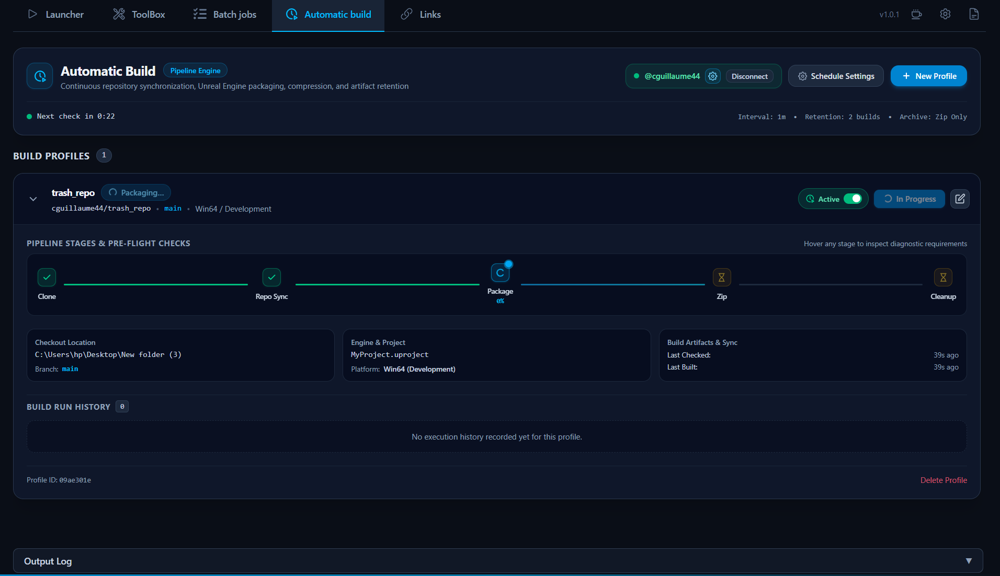

 

# Unreal CommandHelper

Unreal Engine project launcher and toolbox for Windows. Launch projects, run common workflows, schedule batch jobs, and automate builds.

[![Badge Website]][Website]   

 

<!---------------------------------------------------------------------------->

[Website]: https://donate.stripe.com/aFadR2gGB5dd8FYc3K5wI00

<!---------------------------------[ Badges ]---------------------------------->

[Badge Website]: https://img.shields.io/badge/Buy_me_a_Cofee-8A2BE2?style=for-the-badge

## Installation

1. **Go to the [Releases](https://github.com/Ciji-Games/Unreal_CommandHelper/releases) page**
2. Download the latest `.msi` installer (or `-setup.exe` if available)
3. Run the installer

## Features

| Feature | Description |
|---------|-------------|
| [**Launcher**](docs/LAUNCHER.md) | Browse installed Unreal Engine versions, manage projects (`.uproject`), run pinned jobs |
| [**ToolBox**](docs/TOOLBOX.md) | Shader Booster, Regenerate Project, Batch Commit, UMap Helper, Plugin Helper, UProject Helper, Movie Render Queue |
| [**Batch Jobs**](docs/SCHEDULER.md) | Create named batch jobs (sequences of tools) and run them in order |
| [**Automatic Build**](docs/AUTOMATIC_BUILD.md) | Automated repository synchronization, Unreal Engine project packaging (`BuildCookRun`), archive compression, and retention cleanup |

## Screenshots

| Launcher | Toolbox                                    |
|----------|--------------------------------------------|
|  |  |
| Batch Job | Automatic Build                          |
|  |              |

## Requirements

- **Windows 11** (64-bit)

No other prerequisites. The app runs standalone on Windows 11 (WebView2 is pre-installed).

> [!NOTE]
> **Optional** (for specific features):
> - **Unreal Engine** — Launcher, Regenerate, Cook, Package, Build Lighting, UMap, Plugin build, Automatic build
> - **Git** — Batch Commit, Automatic build
> - **Git LFS** — Batch Commit, Automatic build (large files)

## Build from Source

See [Build from Source](docs/BUILD.md) for instructions on building the application from source.

## License

Polyform Noncommercial 1.0.0 — use allowed for non-commercial purposes only. See [LICENSE](LICENSE) for details.
> [!NOTE]
> This license apply to the launcher, not whatever Unreal Engine project you launch with it. I do not allow the commercial use of the launcher app.

## Disclaimer

> [!NOTE]
> This app was **vibe coded**: it was thoroughly tested but the point is to improve my quality of life as an Unreal Engine developer, not to create an absolute state-of-the-art commercial application.
>
> - This app **doesn't modify anything** on your computer, so it's safe to use.
> - We recommend using proper **version control** when launching the various tools available to prevent any issues.
